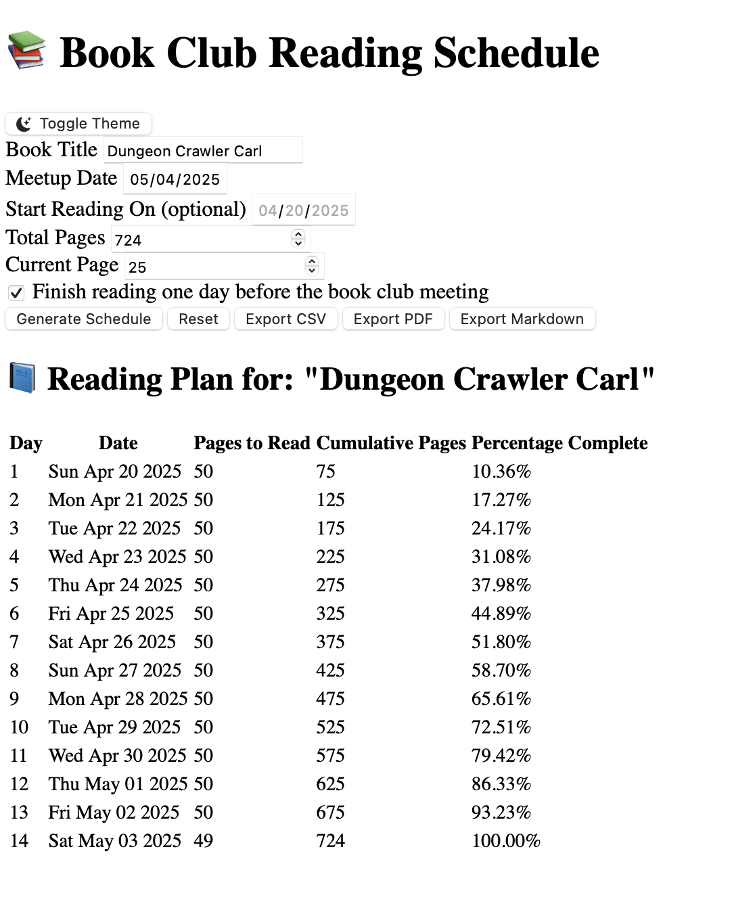

# 📚 Book Club Reading Schedule Generator

A simple, standalone HTML web application designed to help book club members (or individual readers) create a manageable daily reading schedule to finish a book by a specific date.

<!--*(Suggestion: Replace `placeholder.png` with an actual screenshot of the app)*-->

## ✨ Features

*   **📅 Simple Input:** Enter the book title, total pages, your current page, and the target meetup/finish date.
*   **📊 Schedule Generation:** Automatically calculates the number of pages to read each day to finish on time, including today.
*   **📈 Clear Table View:** Displays the schedule with:
    *   Day Number
    *   Specific Date
    *   Pages to Read for that day
    *   Cumulative Pages read
    *   Percentage of the book completed
*   **💾 Automatic Saving:** Remembers your book details and theme preference (`localStorage`) so your schedule is ready when you revisit the page.
*   **🌓 Light/Dark Mode Toggle:** Switch between themes for comfortable viewing. Remembers your preference and can detect your OS setting on the first visit.
*   **🚀 Export Options:**
    *   ✅ **Export Schedule as CSV:** Download the reading plan in a comma-separated values format, easily opened in spreadsheet software.
    *   📄 **Export Schedule as PDF:** Generate a PDF document of the schedule table using jsPDF and html2canvas. (Note: PDF is generated using a light theme background for consistency).
    *   ✍️ **Export Schedule as Markdown:** Get a Markdown-formatted table of the schedule, perfect for notes or documentation.
*   **🔄 Reset Functionality:** Easily clear all inputs and the generated schedule.
*   **📱 Responsive Design:** Uses Bootstrap 5 for a clean layout that works on different screen sizes.
*   **🌐 Standalone:** Runs entirely in the browser - no server needed.

## 🚀 How to Use

1.  **Download:** Get the `BookClubSchedule.html` file.
2.  **Open:** Open the `BookClubSchedule.html` file directly in your preferred web browser (like Chrome, Firefox, Edge, Safari).
3.  **Fill Details:** Enter the "Book Title", the target "Meetup Date", the book's "Total Pages", and the "Current Page" you are on (use 0 if you haven't started).
4.  **Generate:** Click the "Generate Schedule" button.
5.  **View Plan:** The reading schedule will appear in the table below.
6.  **Export (Optional):** Use the "Export CSV", "Export PDF", or "Export Markdown" buttons to save your schedule.
7.  **Toggle Theme (Optional):** Use the Sun/Moon icon button in the top right to switch between light and dark modes.
8.  **Reset (Optional):** Click "Reset" to clear everything and start over.

## 🛠️ Technologies Used

*   **HTML5**
*   **CSS3** (with Bootstrap 5.3+)
*   **JavaScript** (Vanilla JS for core logic and DOM manipulation)
*   **Bootstrap 5.3+:** For UI components and responsive layout.
*   **Bootstrap Icons:** For the theme toggle button icon.
*   **jsPDF:** For generating PDF documents.
*   **html2canvas:** For rendering the HTML table to a canvas element for PDF export.
*   **localStorage:** For saving user inputs and theme preference in the browser.

## 🔮 Potential Future Enhancements

*   More sophisticated validation feedback (e.g., using Bootstrap alerts instead of browser `alert()`).
*   Visual progress indicator during PDF generation.
*   Ability to mark days as "read" or track progress visually.
*   Support for multiple concurrent book schedules.
*   Option to exclude specific days (e.g., weekends) from the reading count.

## 📄 License

This project is licensed under the MIT License - see the [LICENSE](LICENSE) file for details.